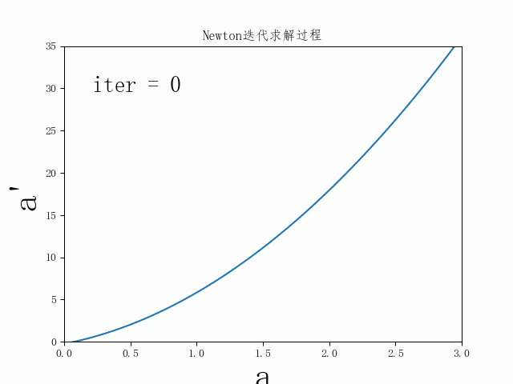
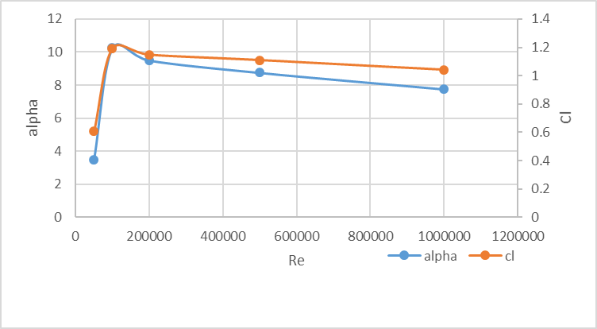
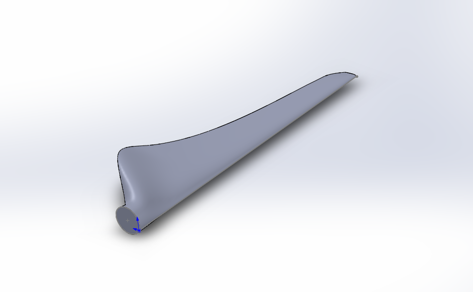

# wind_mechine_design

本项目基于经典动量-叶素理论，求解特定翼型的风机叶片参数
欢迎大家关注：

## 计算过程
经典动量-叶素理论引入了轴向干涉因子和周向干涉因子，并且考虑了叶尖损失，需要迭代计算最优化每个叶素的Cp，从而得到各个叶素的干涉因子

计算过程采用牛顿迭代法和梯度下降法。

## 经典动量叶素理论
动量叶素理论是目前运用最广风力机软件中的叶片设计和气动分析方法，此种方法还衍生了很多修正方法，对于这种方法的研究以便开发满足我们需求的新型叶片和设计软件。动量叶素理论着重是考虑和计算了轴向和周向干涉因子，由此来计算其他参数分量，并用两个干涉因子进行气动性能计算分析。

### 动量叶素基本方法
根据Rankine.Froude的一维流动的动量理论，考虑轴向的损失，并根据动量理论和伯努利方程有以下关系式
$$v_2=\frac{1}{2}\left(v_1+v_3\right)$$
$$v_2=(1-a)v_1$$
$$v_3=(1-2a)v_1$$
其中，$v_1$为风轮前方风速，$v_2$为通过风轮气流速度，$v_3$为风轮后方无限远处的气流速度，$a$为风轮处的轴向速度干涉因子。由涡流理论得知，$a$即为尾涡系在风轮处的轴向速度干涉因子，而轴向诱导速度$v_a$的大小即为$av_1$，方向与风速相反，则在考虑轴向速度干涉因子后，在理想状况下，作用在半径为R的风轮上的推力为：
$$T=\rho\pi R^2v_2\left(v_1-v_3\right)=\frac{1}{2}\rho\pi R^2v_1^24a\left(1-a\right)$$
风轮的功率为
$$P=\frac{1}{2}\rho\pi R^2v_2\left(v_1^2-v_3^2\right)=\frac{1}{2}\rho\pi R^2v_1^34a{(1-a)}^2$$
推力系数和功率系数分别为：
$$\ C_T=\frac{T}{\frac{1}{2}\rho\pi R^2v_1^2}=4a\left(1-a\right)$$
$$C_P=\frac{P}{\frac{1}{2}\rho\pi R^2v_1^3}=4a{(1-a)}^2$$
要使得$C_P$取得最大值，对其表达式进行求导，$\frac{dC_P}{da}=0$时取得最大值
$$\frac{dC_P}{da}=3a^2-4a+1=0$$
解得：$a_1=1$舍去,$a1=\frac{1}{3}$  
将$a$值带入$C_P$的表达式得到$C_P$的最大值是$\frac{16}{27}$
由于考虑了旋转的影响，尾涡系在风轮处有环向诱导速度$v_t$，大小为$v_t=a\prime\mathrm{\Omega r}$，方向与风轮处相对环向速度相同。a\prime为切向速度干涉因子，$v_n$是轴向速度和环向速度的矢量和：
$$v_n=v_t+v_a$$
远方来流空气相对风轮以角速度$\mathrm{\Omega}$旋转，风轮后方除了有角速度$\mathrm{\Omega}$之外，由于风轮叶片的诱导作用又增加了一个角速度w，此时风轮后方的角速度为$(\mathrm{\Omega}+w)$
这样，考虑诱导速度后，气流相对于叶素的速度W的大小为：
$$W=[(1-a)v1]2+[(1+a')Ωr]2=v11-a2+1-a'2λ2$$ 
其中
$$\lambda=\frac{\mathrm{\Omega r}}{v_1}=\frac{\lambda_0r}{R}$$    
为当地叶尖速比
$$\ \ \lambda_0=\frac{\mathrm{\Omega R}}{v_1} $$
为叶尖速比
$$tan{\mathrm{\Phi}=\frac{1-a}{1+a\prime}\frac{v_1}{\mathrm{\Omega r}}=\frac{1-a}{1+a^\prime}\frac{1}{\lambda}\ } $$
$$\beta=\mathrm{\Phi}-\alpha\  $$
若沿风轮径向流动很小，径向干扰可以忽略不计，那么根据动量理论可写出径向距离为r处的微元环对风轮推力
$$dT=4a\left(1-a\right)\rho v_1^2\pi rdr $$
取$(r,r+dr)$环形流管为研究对象，根据动量矩理论可以写出风轮半径r处的扭矩
$$dM=\left[\left(\mathrm{\Omega}+w\right)r^2-\mathrm{\Omega}r^2\right]dm=4\pi\rho\mathrm{\Omega}v_1(1-a)a\prime r^3dr$$
环面上获得的功率为：
$$dP=\mathrm{\Omega dM}=4\pi\rho v_1\mathrm{\Omega}^2\left(1-a\right)a^\prime r^2dr$$
风能利用的微元量为：
$$dC_p=\frac{dP}{\frac{1}{2}\rho v_0^3ds}=\frac{4\pi\rho v_1\mathrm{\Omega}^2\left(1-a\right)a^{\prime r^3}dr}{\frac{1}{2}\rho v_1^32\pi rdr}
=4(1-a)a\prime\lambda^2$$
上式即是微元面上的风能利用系数的表达式，在整个叶片上沿叶片长度的所有截面微元处相加即可得到整个叶片的风能利用系数。

## 总体分析

首先明确需要计算的参数之间的相互关系
$$F=f(r,R,n,r_hub,\mathrm{\Phi})$$

$$\mathrm{\Phi}=f(a,a\prime,\lambda)$$

$$\lambda=f(r,v_1,n) $$

$$a\prime=f(a,r,R,n,r_hub,v_1) $$

$$C_p=f(F,a,a\prime,\lambda) $$

$$l=f(r,n,a,\mathrm{\Phi},F,C_l)$$

$$R_e=f(l,v,W) $$

$$W=f(a,a\prime,\lambda,v_1) $$

$$C_l=f(R_e)$$

$$f\left(a,a^\prime,F,\lambda\right)=0$$

我们发现1至4四个函数表达式，恒等式10和最大化目标5构成了关于$\lambda,F,a,a^\prime,\mathrm{\Phi},C_p$的闭合求解条件，但考虑到它们之间隐式的函数关系以及需要通过最大化来确定某一个参数，我们决定采取牛顿迭代法和基于梯度的最大化方法结合的方式求取最优条件下的$\lambda,F,a,a^\prime,\mathrm{\Phi},C_p$。
另一方面，6至9四个函数表达式也构建了关于$l,R_e,W,C_l$的闭合求解条件，但考虑到9本身函数形式的不确定性，需要进一步补充数据或者表达式，我们同样决定采用牛顿迭代法计算得到$l,R_e,W,C_l$。

优化示意

我们查找了Re与NACA24112翼型的最佳攻角和升力系数关系数据，得到如下结果

所以在实践中采用了线性插值的方法解算Re和Cl，alpha的关系。

## 设计结果
将计算的得到的参数通过Solidworks建模得到如下结果

详细参数键model_arg文件夹

## 参考文献

- [1]王凡. 风力发电机的叶片设计方法研究[D].南京理工大学,2007.
- [2]王昊,范海哲,李帅斌.风力发电机叶片建模及有限元分析[J].上海电力学院学报,2016,32(03):257-260.
- [3]王学永. 风力发电机叶片设计及三维建模[D].华北电力大学（河北）,2008.
- **[http://airfoiltools.com/calculator/reynoldsnumber?MReNumForm%5Bvel%5D=13&amp;MReNumForm%5Bchord%5D=1.2&amp;MReNumForm%5Bkvisc%5D=1.5111E-5&amp;yt0=Calculate](http://airfoiltools.com/calculator/reynoldsnumber?MReNumForm%5Bvel%5D=13&MReNumForm%5Bchord%5D=1.2&MReNumForm%5Bkvisc%5D=1.5111E-5&yt0=Calculate)**
- **[http://airfoiltools.com/airfoil/details?airfoil=naca24112-jf#polars](http://airfoiltools.com/airfoil/details?airfoil=naca24112-jf#polars)**
