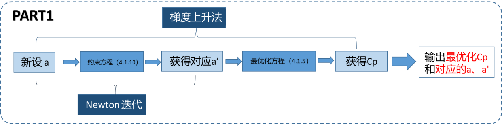
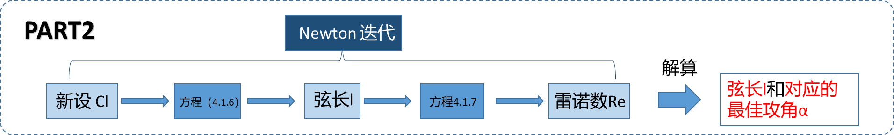

# wind_mechine_design

本项目基于经典动量-叶素理论，求解特定翼型的风机叶片参数
欢迎大家关注：

## 计算过程

## 总体分析

优化示意

我们查找了Re与NACA24112翼型的最佳攻角和升力系数关系数据，得到如下结果

所以在实践中采用了线性插值的方法解算Re和Cl，alpha的关系。

## 设计结果
将计算的得到的参数通过Solidworks建模得到如下结果

详细参数键model_arg文件夹

## 参考文献

- [1]王凡. 风力发电机的叶片设计方法研究[D].南京理工大学,2007.
- [2]王昊,范海哲,李帅斌.风力发电机叶片建模及有限元分析[J].上海电力学院学报,2016,32(03):257-260.
- [3]王学永. 风力发电机叶片设计及三维建模[D].华北电力大学（河北）,2008.
- **[http://airfoiltools.com/calculator/reynoldsnumber?MReNumForm%5Bvel%5D=13&amp;MReNumForm%5Bchord%5D=1.2&amp;MReNumForm%5Bkvisc%5D=1.5111E-5&amp;yt0=Calculate](http://airfoiltools.com/calculator/reynoldsnumber?MReNumForm%5Bvel%5D=13&MReNumForm%5Bchord%5D=1.2&MReNumForm%5Bkvisc%5D=1.5111E-5&yt0=Calculate)**
- **[http://airfoiltools.com/airfoil/details?airfoil=naca24112-jf#polars](http://airfoiltools.com/airfoil/details?airfoil=naca24112-jf#polars)**
